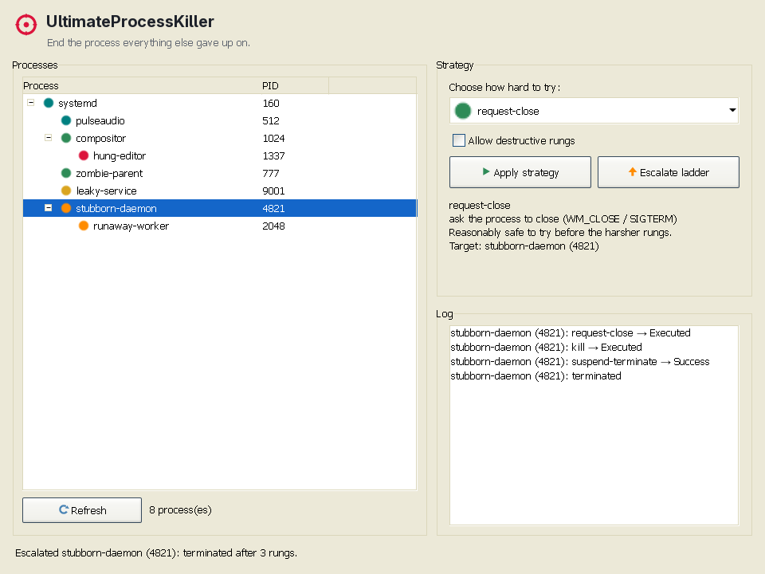
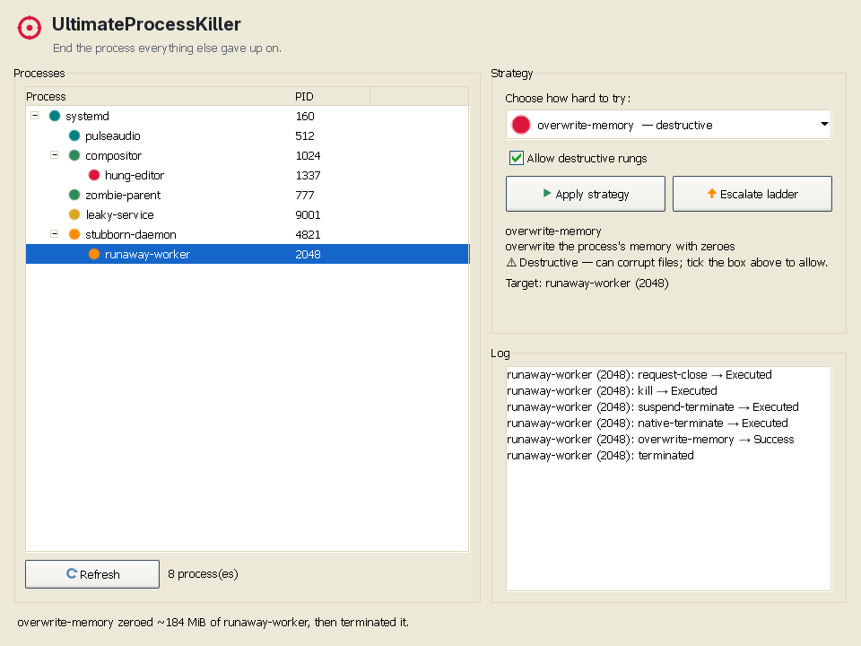

# UltimateProcessKiller

[](https://github.com/Hawkynt/UltimateProcessKiller/blob/main/LICENSE)
[](https://github.com/Hawkynt/UltimateProcessKiller)

[](https://github.com/Hawkynt/UltimateProcessKiller/actions/workflows/ci.yml)


[](https://github.com/Hawkynt/UltimateProcessKiller/stargazers)
[](https://github.com/Hawkynt/UltimateProcessKiller/network/members)
[](https://github.com/Hawkynt/UltimateProcessKiller/issues)


> Some processes will not die. Task Manager greys out, `taskkill /f` returns access denied, `kill -9`
> leaves a zombie, and the thing sits there holding a file lock or a port. UltimateProcessKiller is a
> cross-platform toolkit of escalating termination strategies — from the ordinary kill down to zeroing
> a process's memory — for the last stubborn process that everything else gave up on, usable from a CLI
> or a small NativeForms GUI.



## 🧭 Vision

Killing a process is supposed to be one call. In practice a process can outlive that call: a driver or
anti-tamper layer blocks `PROCESS_TERMINATE`, a hung message loop ignores every close, a handle leak
keeps a file pinned after the window is gone, or the thing is already dead and lingering as a zombie no
`kill -9` can touch. UltimateProcessKiller collects the tricks that normally live scattered across forum
posts and half-finished gists into one ordered escalation ladder, each rung more invasive than the last,
so that when the polite kill fails there is always a next thing to try short of a reboot.

The strategies divide naturally by how deep they reach. The gentle rungs — ask-nicely-then-force, the
managed kill, a process-tree kill, suspend-then-terminate — rest on portable primitives and behave the
same on Windows, Linux and macOS. The surgical rungs reach into kernel internals — NT syscalls, ptrace,
closing a process's handles, overwriting its address space — and those are inherently platform-bound.
The core embraces that split rather than hiding it: it exposes exactly the strategies the running OS can
honestly back, and no more. On top of it sit two front ends — a scriptable **CLI** (`upk`) for reaching
into a single stubborn process, and a **small [NativeForms](https://github.com/Hawkynt/NativeForms)
GUI** that runs on all three desktops so you can watch the gentle approaches fail and reach for the
surgical ones deliberately.

## ✨ Features

- **An escalation ladder**, walked gentlest-first: ask-to-close, forced kill, tree kill,
  suspend-then-terminate, debugger attach, per-thread termination, the native syscall kill, injecting
  an exit call, handle closing and memory overwrite.
- **Genuinely cross-platform.** The portable rungs run on Windows, Linux and macOS; the deep rungs are
  implemented per platform (Win32/NT, ptrace + `/proc`) and offered only where they work.
- **Linux zombie reaping.** A dedicated rung clears a defunct process by nudging its parent to reap it,
  or by removing a stuck parent so init adopts and reaps the zombie.
- **A scriptable CLI (`upk`)** — target by PID or name, apply one strategy or `--escalate` the whole
  ladder, with `--json` output and a `--dry-run`.
- **A lightweight GUI** on [NativeForms](https://github.com/Hawkynt/NativeForms): trim/AOT-friendly,
  native-themed, the same window on every desktop. Processes are shown as a parent/child **tree**, each
  strategy carries an icon and a plain-language description, and terminations run off the UI thread so
  the window stays responsive.
- **Strategies as a library.** `UltimateProcessKiller.Core` is a plain, reflection-free, AOT-compatible
  API you can call directly, independent of either front end.
- **A thin, auditable native layer** — source-generated `LibraryImport` over `ntdll`/`kernel32`/`user32`
  on Windows and over libc/ptrace and `/proc` on Linux, with `SafeHandle`-owned handles.

## 🧩 Support matrix

Each strategy trades reliability against how invasive it is, and against how far it ports. The gentler
rungs leave the process a chance to clean up and run everywhere; the lower rungs do not, and several
exist only on one platform. Reach down the ladder only as far as you must.

| Strategy | Windows | Linux | macOS | Mechanism | Notes |
| --- | :---: | :---: | :---: | --- | --- |
| `request-close` | ✅ | ✅ | ✅ | [`WM_CLOSE`](https://learn.microsoft.com/windows/win32/winmsg/wm-close) / `SIGTERM` | Asks the process to close; lets it save and exit. |
| `kill` | ✅ | ✅ | ✅ | [`Process.Kill`](https://learn.microsoft.com/dotnet/api/system.diagnostics.process.kill) / `SIGKILL` | The ordinary forced kill. Try this first. |
| `kill-tree` | ✅ | ✅ | ✅ | `Process.Kill(entireProcessTree)` / `/proc` walk | Kills the process and every descendant. |
| `suspend-terminate` | ✅ | ✅ | ✅ | `NtSuspendProcess`+kill / `SIGSTOP`+`SIGKILL` | Freezes the process so it cannot react, then kills it. |
| `attach-debugger` | ✅ | ✅ | — | [`DebugActiveProcess`](https://learn.microsoft.com/windows/win32/api/debugapi/nf-debugapi-debugactiveprocess) / `ptrace(ATTACH)` | Takes the target down as its debugger. macOS needs `task_for_pid` entitlements. |
| `terminate-threads` | ✅ | ✅ | — | [`TerminateThread`](https://learn.microsoft.com/windows/win32/api/processthreadsapi/nf-processthreadsapi-terminatethread) / `tgkill` | ⚠️ On Linux a fatal signal takes the whole process, not one thread. |
| `native-terminate` | ✅ | — | — | [`NtTerminateProcess`](https://learn.microsoft.com/windows-hardware/drivers/ddi/ntddk/nf-ntddk-ntterminateprocess) | Native path that can succeed where the managed kill is blocked. |
| `inject-exit` | ✅ | ✅ | — | [`CreateRemoteThread`](https://learn.microsoft.com/windows/win32/api/processthreadsapi/nf-processthreadsapi-createremotethread)→`ExitProcess` / ptrace `exit_group` | Makes the process exit from inside itself. Linux injection is x86-64 only. |
| `close-handles` | ✅ | — | — | [`DuplicateHandle`](https://learn.microsoft.com/windows/win32/api/handleapi/nf-handleapi-duplicatehandle) `DUPLICATE_CLOSE_SOURCE` | ⚠️ Yanks the target's handles away; frees locks but corrupts its state. |
| `overwrite-memory` | ✅ | ✅ | — | [`WriteProcessMemory`](https://learn.microsoft.com/windows/win32/api/memoryapi/nf-memoryapi-writeprocessmemory) / `/proc/<pid>/mem` | ⚠️ The nuclear option — scribbles zeroes across the address space. |
| `reap-zombie` | — | ✅ | — | `waitpid` / `SIGCHLD` to parent / remove parent | Clears a defunct process a kill cannot touch. |

`✅` implemented · `—` not available on that platform. `⚠️` destructive beyond a clean kill: may corrupt
open files or leave orphaned kernel state. The Linux ptrace rungs (`attach-debugger`, `inject-exit`,
`overwrite-memory`) require permission to trace the target — a descendant, or `CAP_SYS_PTRACE` /
relaxed `yama` scope otherwise.

## 📦 Installation

Requires the [.NET 10 SDK](https://dotnet.microsoft.com/download/dotnet/10.0). The deep rungs need a
token privileged enough to open the target — Administrator on Windows, `root`/`sudo` or a permissive
`ptrace` scope on Linux.

```bash
git clone https://github.com/Hawkynt/UltimateProcessKiller.git
cd UltimateProcessKiller
dotnet build -c Release
```

Prebuilt single-file binaries for `win-x64`, `linux-x64` and `osx-arm64` are attached to every
[nightly](https://github.com/Hawkynt/UltimateProcessKiller/releases) and release.

## 🚀 Quick start

Target a process and either pick a strategy or let the CLI walk the ladder until it dies:

```bash
# List what strategies this platform supports.
upk --strategies

# Walk the escalation ladder against a process by name, stopping at the first rung that works.
upk --name stubborn --escalate

# Apply one strategy to a specific PID.
upk --pid 1234 --strategy suspend-terminate

# Reap a Linux zombie by removing whatever parent left it defunct.
upk --pid 4821 --strategy reap-zombie
```

The strategies are also a plain library, which is what both front ends call:

```csharp
using UltimateProcessKiller;

var killer = ProcessKiller.ForCurrentPlatform();

// One strategy…
var result = killer.Terminate(pid: 1234, TerminationMethod.SuspendAndTerminate);

// …or walk the whole ladder, gentlest first, stopping at the first that works.
var report = ProcessExecutioner.Escalate(killer, 1234, new EscalationOptions { AllowDestructive = true });
Console.WriteLine(report.Succeeded ? "gone" : "survived everything");
```

## 🖼️ Screenshots

The GUI lists running processes on the left and the strategy ladder on the right; the log records every
attempt, gentlest rung first.


Destructive rungs are gated behind a checkbox. With it ticked, the ladder can run all the way down to a
memory overwrite, and the log shows every rung it took:



## 🗺️ Roadmap

- **macOS deep rungs.** `attach-debugger`, `terminate-threads` and `inject-exit` via Mach
  (`task_for_pid`, `thread_terminate`), which need a signed, entitled build.
- **Linux `inject-exit` on ARM64**, alongside the current x86-64 syscall injection.
- **Linux `close-handles`** via `/proc/<pid>/fd`, where the platform allows it.

## 🏗️ Architecture

`UltimateProcessKiller.Core` is the heart: `IProcessKiller` with one platform implementation each
(`WindowsProcessKiller`, `LinuxProcessKiller`, `MacProcessKiller`), a `ProcessKillerBase` that gates the
supported set and verifies a target is actually gone after each attempt, and `ProcessExecutioner` which
walks the ladder. `ProcessKiller.ForCurrentPlatform()` hands back the right one. Each platform keeps its
native surface local to itself — `Platforms/Windows/NativeMethods.*` mirrors the Win32/NT headers with
source-generated `LibraryImport`; `Platforms/Linux` binds libc, `ptrace` and `/proc`. Every strategy is
a value on the `TerminationMethod` enum, ordered by invasiveness, with reflection-free metadata in
`TerminationMethodInfo` so the whole core is AOT-clean.

Two front ends wrap that core and add nothing but presentation: `UltimateProcessKiller.Cli` (`upk`)
parses a target and a strategy and prints what happened; `UltimateProcessKiller.Gui`, built on
[NativeForms](https://github.com/Hawkynt/NativeForms), lists processes and exposes the ladder as
buttons. Because NativeForms is trim/AOT-compatible and native-themed on Win32, GTK and Cocoa, the GUI
stays a small single binary on every desktop.

## 🔌 Dependencies

| Dependency | Used for | Scope |
| --- | --- | --- |
| [.NET 10](https://dotnet.microsoft.com/download/dotnet/10.0) | Runtime and BCL | Everywhere |
| [`Hawkynt.NativeForms`](https://www.nuget.org/packages/Hawkynt.NativeForms/) | Cross-platform GUI toolkit | GUI only |
| [`Hawkynt.NativeForms.Backends.Windows`](https://www.nuget.org/packages/Hawkynt.NativeForms.Backends.Windows/) / [`.Gtk`](https://www.nuget.org/packages/Hawkynt.NativeForms.Backends.Gtk/) / [`.MacOS`](https://www.nuget.org/packages/Hawkynt.NativeForms.Backends.MacOS/) | Native rendering backend | GUI, per platform |

The core library and the CLI have no dependency beyond the BCL.

## ⚠️ Limitations

- **The destructive rungs are genuinely destructive.** Closing a process's handles or overwriting its
  memory can corrupt files it had open and leave the system in a state only a reboot fully clears; they
  are gated behind `--allow-destructive` and are tools of last resort, not a faster kill.
- **Portability has a floor.** `native-terminate` (NT syscall), `close-handles` and `reap-zombie` have
  no equivalent on every platform; the matrix marks those `—` rather than pretending otherwise. Some
  shared rungs also differ in semantics — killing a thread leaves the process alive on Windows but a
  fatal POSIX signal takes the whole process.
- **macOS ships the portable rungs only.** The Mach-level rungs need code-signing entitlements a
  portable tool cannot assume, so they report `NotSupported` rather than failing at runtime.
- **Privilege bound.** Opening a protected or higher-integrity process, or ptracing a non-descendant,
  fails without a sufficiently privileged token; affected strategies report `AccessDenied`.

## 🛠️ Building

```bash
dotnet build -c Release
dotnet test -c Release
```

Build a single self-contained executable for one platform (no .NET install needed to run it). Each app
carries publish profiles for `win-x64`, `linux-x64` and `osx-arm64`, so Visual Studio's **Publish** and
the command line produce the same trimmed single file:

```bash
dotnet publish UltimateProcessKiller.Cli -c Release -p:PublishProfile=linux-x64   # or win-x64 / osx-arm64
dotnet publish UltimateProcessKiller.Gui -c Release -p:PublishProfile=linux-x64
```

## ❤️ Support

If this project saves you time or money, consider supporting its development:

[](https://github.com/sponsors/Hawkynt)
[](https://www.paypal.me/hawkynt)

## 📜 License

Licensed under LGPL-3.0-or-later — see [LICENSE](LICENSE).
